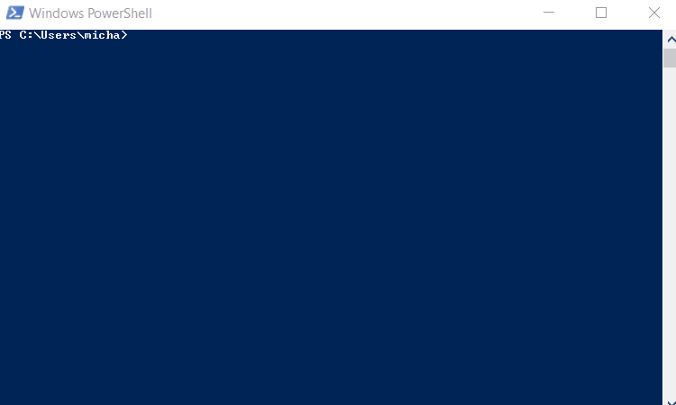

# Project Name

> - A scraper developed in Ruby

This project scrapes the new arrived developer books from a webpage called 'Bol.com' and returns the articles as an array of hashes

## Built With

- Ruby
- Nokogiri Gem
- Awesome_print gem

## Getting Started

**To get a local copy up and running follow these simple example steps**

- fork the repository and create a local one on your computer
- move to the repository inside the command line using `cd` and the path to the file
- run `bundle install`
- to run the file enter `bin/main.rb` from inside the main folder in the repository
- the file will pull the data from the url and return it as an array of hashes
- you can select several options on how you would like to see the data returned by following the instructions

## Run tests

- test have been created to run them enter `rspec` in the command line
- inside the "spec" folder in the file "process_spec.rb" test can be added if needed

### future version

In the future versions the program will be expanded so the user can enter a custom url and get the data from the search results.

## Author

👤 **Michael Threels**

- Github: [@githubhandle](https://github.com/mikethreels)
- Twitter: [@twitterhandle](https://twitter.com/MichaelThreels)
- LinkedIn :[@linkedinhandle](https://www.linkedin.com/in/michael-threels-24101991)

## 🤝 Contributing

Contributions, issues and feature requests are welcome!

Feel free to check the [issues page](issues/).

## Show your support

Give a ⭐️ if you like this project!

## Acknowledgments

- Hat tip to anyone whose code was used
- Inspiration
- etc

